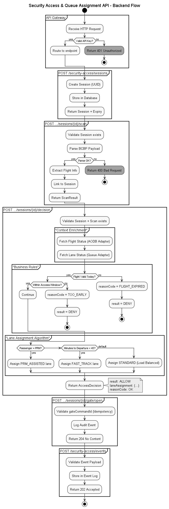

# Airport Passenger Flow & Security Checkpoint Automation

This repository contains a conceptual and technical design exercise focused on **airport passenger processing**, with special emphasis on **security checkpoint access automation and intelligent queue assignment**.

## 🚀 Executive Summary

This design demonstrates a **Robust, Privacy-First, and Resilient** approach to airport automation. It goes beyond happy-path scenarios to address critical operational realities such as network failures, hardware variability, and data privacy regulations (GDPR). The solution is designed to operate continuously even during backend outages, ensuring passenger flow is never disrupted.

---

## 📁 Repository Contents

### 1. Passenger Journey – Process Design

📄 **[`airport_flow.md`](./airport_flow.md)**

Describes the **end-to-end passenger journey** from entering the departure terminal to boarding the aircraft.

- **Scope**: Terminal Entry → Boarding.
- **Focus**: Inputs, outputs, participants, and system integrations at each step.

### 2. Security Checkpoint e-Gate – Requirements

📄 **[`checkpoint.md`](./checkpoint.md)**

Defines the requirements for an **automated security checkpoint e-gate workstation**.

- **Core Logic**: Boarding pass validation and intelligent queue assignment.
- **Enterprise Features**:
  - **Offline Validation Mode**: Validates IATA BCBP digital signatures locally when the backend is down.
  - **Hardware Abstraction Layer (HAL)**: Supports multiple hardware vendors (gates, scanners) via a unified interface.
  - **Data Privacy**: Enforces PII masking in all logs and events.
  - **Hot-Reloadable Config**: Allows rule changes without downtime.

### 3. Backend API Specification

📄 **OpenAPI Specification (Swagger UI)**
🔗 **[View rendered API documentation](https://editor.swagger.io/?url=https://raw.githubusercontent.com/juliohurtado/assaia/refs/heads/main/openapi.yaml)**

OpenAPI 3.0 specification for the **Airport Security Access & Queue Assignment API**.

- **Key Capabilities**: Includes sessions, scan validation, decision logic, gate control, and a `/heartbeat` endpoint for hardware health monitoring.

### 4. UML Diagram – Robust Activity Flow

Illustrates the end-to-end flow with a focus on **Request-Response cycles** and **Resilience**:

- Visualizes the extensive **Offline Fallback** path.
- Clarifies synchronous context fetching (Flight Status, Queue Load) vs. asynchronous events.
- Handles scan errors and access denial flows.

---

## 🏗️ Key Architectural Highlights

This solution implements several "Day 2" operational patterns:

1.  **Resilience & Offline First**:
    The system is designed to fail open or degrade gracefully. Critical validation steps (cryptographic signature checks) can occur locally, ensuring distinct queues (e.g., Round Robin) can still operate without the central brain.

2.  **Privacy by Design**:
    Strict requirements preventing PII leaks. Passenger names are never logged in plain text, decoupling operational metrics from personal identity.

3.  **Hardware Independence**:
    A **Hardware Abstraction Layer (HAL)** requirement ensures the business logic is decoupled from specific device drivers (e.g., changing a Gunnebo gate for a Dormakaba one doesn't require code changes).

4.  **Observability**:
    Dedicated `Heartbeat` events allow the central monitoring system to detect not just "app online" but also "scanner jammed" or "gate stuck" states.

---

## 🧭 How to Navigate This Repository

1.  Start with **`airport_flow.md`** to understand the high-level passenger context.
2.  Review **`checkpoint.md`** for detailed functional and non-functional requirements.
3.  Check the **Swagger UI** to see the technical contract.
4.  Examine the **UML Diagram** (`uml.png`) to visualize the decision logic and fallback paths.

---

## 📌 Notes

This repository is a **design and analysis exercise**. All processes, rules, and integrations are based on common airport operations and best-practice engineering assumptions.
